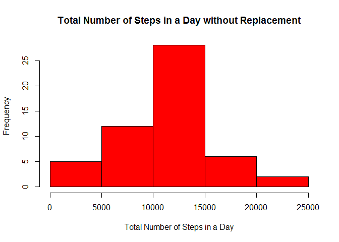
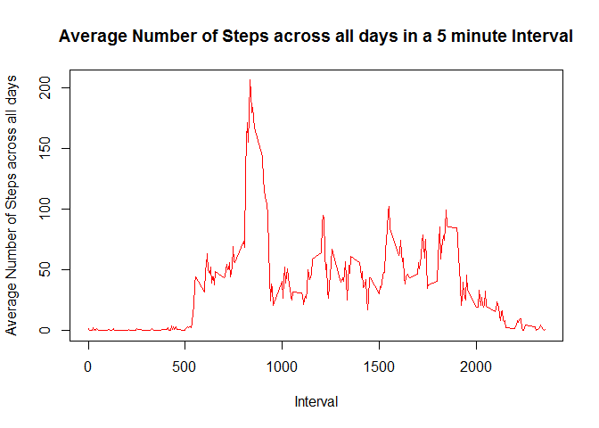
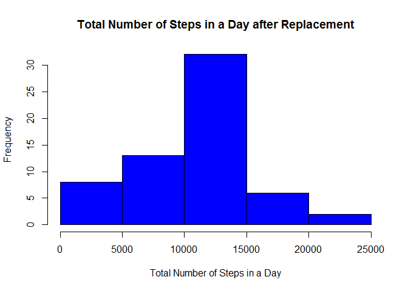
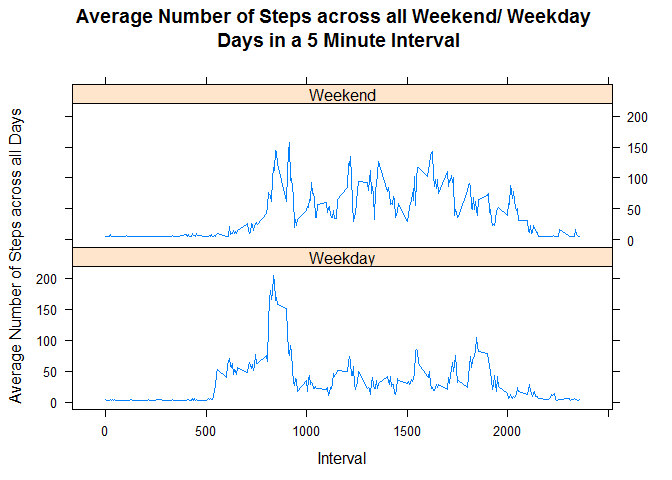

# Reproducible Research: Peer Assessment 1


## Loading and preprocessing the data

The file was unzipped and read as a .csv file


```r
if (!file.exists("activity")) {unzip("activity.zip")
                               activity<-read.csv("activity.csv",stringsAsFactors=FALSE)}
```

## What is mean total number of steps taken per day?

The date column values were converted from character type to date type, and all the missing values were removed from the data set

```r
activity_without_rep<-activity
activity_without_rep$date<-as.Date(activity_without_rep$date)
activity_without_rep<-na.omit(activity_without_rep)
```

The steps were grouped by date and totalled for every day, and the columns in the resultant grouped data set were renamed to their original names

```r
activity_without_rep_grp<-aggregate(activity_without_rep$steps, by=list(activity_without_rep$date),sum)
names(activity_without_rep_grp)[1]<-paste("date")
names(activity_without_rep_grp)[2]<-paste("steps")
```

A histogram was plotted for total number of steps in a day without replacement

```r
hist(activity_without_rep_grp$steps,freq=TRUE, xlab="Total Number of Steps in a Day", main="Total Number of Steps in a Day without Replacement", col="red")
```

 

Mean of the total number of steps in a day was calculated

```r
mean(activity_without_rep_grp$steps)
```

```
## [1] 10766.19
```

Median of the total number of steps in a day was calculated

```r
median(activity_without_rep_grp$steps)
```

```
## [1] 10765
```


## What is the average daily activity pattern?

A new data set was created from the original data set with only the required columns (interval and steps)

```r
activity_in_five_min_interval<-activity[,c(3,1)]
```

All steps were grouped by interval and the mean number of steps for every interval was calculated, and the columns in the resultant grouped data set were renamed to their original names

```r
activity_in_five_min_interval_grp<-aggregate(activity_in_five_min_interval$steps, by=list(activity_in_five_min_interval$interval),mean,na.rm=TRUE)
names(activity_in_five_min_interval_grp)[1]<-paste("interval")
names(activity_in_five_min_interval_grp)[2]<-paste("steps")
```

A time series plot was created for the mean number of steps in a 5 minute interval averaged across all days

```r
plot(activity_in_five_min_interval_grp$steps ~ activity_in_five_min_interval_grp$interval, type = "l", xlab="Interval", ylab="Average Number of Steps across all days", main="Average Number of Steps across all days in a 5 minute Interval", col="red" )
```

 

The interval with the maximum number of steps was calculated

```r
activity_in_five_min_interval_grp[which(activity_in_five_min_interval_grp$steps==max(activity_in_five_min_interval_grp$steps)),1]
```

```
## [1] 835
```


## Imputing missing values

The number of missing values was calculated

```r
sum(is.na(activity))
```

```
## [1] 2304
```


### Strategy to replace the missing values

The daily mean was used to replace any missing value for that date and in certain cases, the daily mean around the date on the missing value row was used for replacement. The steps are summarized below.

- A lookup table was created with the average number of steps ignoring the missing values, for every date
- The rows in the original data frame were looped through and on encountering a missing value, the date on the row was matched with a date in the lookup table, and the missing value in the original table was replaced with the corresponding mean from the lookup table
- If the mean for that date was unavailable, then the mean for a day ahead was used for the replacement
- If the mean for a day ahead was unavailable as well, then the mean for the day earlier was used for the replacement 

This strategy was sufficient to replace all the missing values in the given data set.


```r
#Creating a lookup table with average number of steps in a day without replacing the missing values
#Looping through all rows of the original data frame and on encountering a missing value,
#the date on the row is matched with a date in the lookup table
#and the missing value in the original data frame is replaced with the corresponding mean from the lookup table 
#If the mean in the lookup table is missing as well,
#then the mean from 1 day ahead replaces the missing value
#If the mean from 1 day ahead in the lookup table is also missing,
#then the mean from 1 day earlier in the lookup table replaces the missing value
activity_with_rep<-activity
activity_with_rep_grp<-aggregate(activity_with_rep$steps, by=list(activity_with_rep$date),mean, na.rm=TRUE)
names(activity_with_rep_grp)[1]<-paste("date")
names(activity_with_rep_grp)[2]<-paste("steps")
for (i in 1:nrow(activity_with_rep)){
    if(is.na(activity_with_rep[i,1])){
        val<-subset(activity_with_rep_grp, activity_with_rep_grp$date==activity_with_rep[i,2])$steps
        if(is.na(val)){
            ind<- as.numeric(which(activity_with_rep_grp$date==activity_with_rep[i,2]))
            if(is.na(activity_with_rep_grp[ind+1,2])){
                activity_with_rep[i,1]<-activity_with_rep_grp[ind-1,2]}
            else{
                activity_with_rep[i,1]<-activity_with_rep_grp[ind+1,2]}
        }
        else{
            activity_with_rep[i,1]<-subset(activity_with_rep_grp, activity_with_rep_grp$date==activity_with_rep[i,2])$steps}
    }
}
```

All steps were grouped by date and then totalled for every day

```r
activity_with_rep_grp_sum<-aggregate(activity_with_rep$steps, by=list(activity_with_rep$date),sum)
names(activity_with_rep_grp_sum)[1]<-paste("date")
names(activity_with_rep_grp_sum)[2]<-paste("steps")
```

A histogram was created for total number of steps in a day, after the missing values have been replaced

```r
hist(activity_with_rep_grp_sum$steps,freq=TRUE, xlab="Total Number of Steps in a Day", main="Total Number of Steps in a Day after Replacement", col="blue")
```

 

The mean of the total number of steps in a day after replacement, was calculated

```r
mean(activity_with_rep_grp_sum$steps)
```

```
## [1] 10286.87
```

The median of the total number of steps in a day after replacement, was calculated

```r
median(activity_with_rep_grp_sum$steps)
```

```
## [1] 10600
```

### Impact on mean and median after replacing the missing values

Replacing the missing values with their respective daily means or if the daily mean was unavailable, with the daily mean a day later or a day earlier caused a small drop in the overall mean and overall median values. This means that the missing values were replaced with daily means that, on the average, were below the overall daily mean (averaged for all days). Imputation produced a very minimal drop in the mean and median values.


## Are there differences in activity patterns between weekdays and weekends?

The required packages, plyr and lattice were installed and loaded if absent in the workspace

```r
#Installing the required packages if absent
is_installed <- function(pkg) is.element(pkg, installed.packages()[,1])
if(!is_installed("plyr"))  
{  
        install.packages("plyr",repos="http://lib.stat.cmu.edu/R/CRAN", dependencies=TRUE)  
}  
suppressWarnings(library("plyr",character.only=TRUE,quietly=TRUE,verbose=FALSE))

if(!is_installed("lattice"))  
{  
        install.packages("lattice",repos="http://lib.stat.cmu.edu/R/CRAN", dependencies=TRUE)  
}  
suppressWarnings(library("lattice",character.only=TRUE,quietly=TRUE,verbose=FALSE))
```

All the dates in the missing- value- replaced table were converted to day-of-the-week

```r
activity_with_rep_panel<-activity_with_rep
activity_with_rep_panel$date<-as.Date(activity_with_rep_panel$date)
activity_with_rep_panel$date<-weekdays(activity_with_rep_panel$date)
```

All the values in the date column in the missing- value- replaced table were converted to weekday or weekend

```r
for (i in 1:nrow(activity_with_rep_panel)){
    if(activity_with_rep_panel$date[i] %in% c("Saturday", "Sunday")){
        activity_with_rep_panel[i,2]<-"Weekend"
    }
    else{
        activity_with_rep_panel[i,2]<-"Weekday"
    }
}
```

The date column was converted to a factor

```r
activity_with_rep_panel$date<-factor(activity_with_rep_panel$date)
```

The steps were grouped by by day of the week, followed by interval and then the mean number of steps were calculated
The columns in the resultant grouped data set were renamed to day, interval and steps respectively

```r
activity_with_rep_panel_grp<-ddply(activity_with_rep_panel,.(date,interval),function(x) mean(x[,1]))
colnames(activity_with_rep_panel_grp)<-c("day","interval","steps")
```

A time series panel plot was created using the lattice package

```r
xyplot(activity_with_rep_panel_grp$steps ~ activity_with_rep_panel_grp$interval|activity_with_rep_panel_grp$day, type="l",xlab="Interval", ylab="Average Number of Steps across all Days", main="Average Number of Steps across all Weekend/ Weekday \n Days in a 5 Minute Interval",layout=c(1,2))
```

 

The peak number of steps traversed was reached about the same time on the weekday as on the weekend but as time went by, during mid-day, the activity was lower during a weekday than on the weekend. Towards the end of the day, the activity during the weekday was not very different from the weekend. The plot seemed typical of a person's standard work day with an active weekend.
